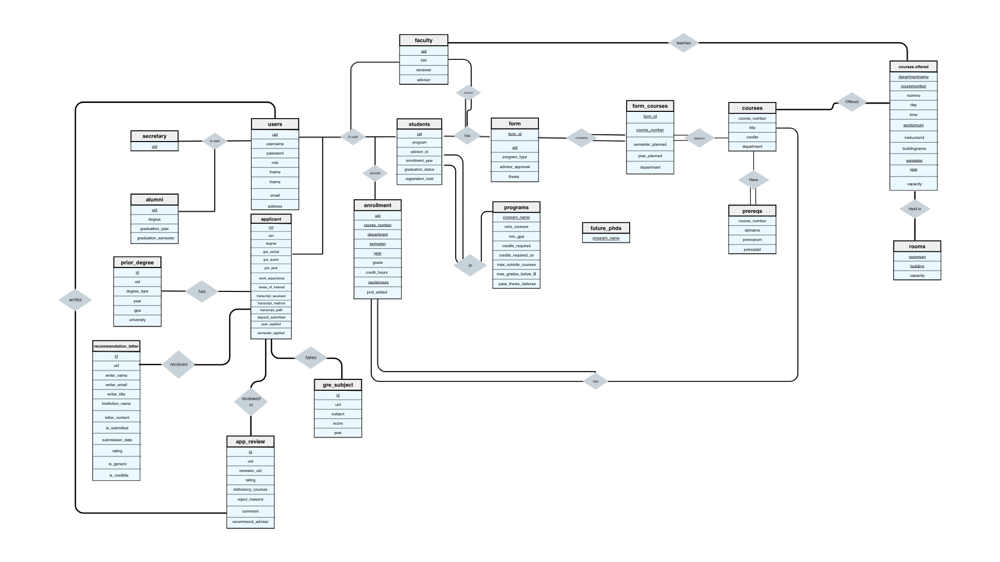

**Phase 2 Report - kkr**

**DB Design**: An ER Diagram updated to reflect your final design and an explanation for what normal form you believe your tables meet
    ER Diagram:
    

**Users and Role Tables** (users, students, faculty, secretary, alumni)
- The users table stores general information about all system users. The primary key is uid which uniquely identifies each user, and all attributes such as username, password, and email depend directly on this key. This table follows 3NF normalization because there are no partial or transitive dependencies, and all attributes describe only the user.
- The students, faculty, secretary, and alumni tables extend the users table by storing role-specific information. Each table users uid as both a primary key and foreign key, ensuring a one-to-one relationship with users. These tables follow 3NF because all attributes depend solely on uid, and no non-key attribute depends on another non-key attribute. Separating these roles into different tables avoids null values and keeps schema organized.

**Application Tables** (applicant, prior_degree, gre_subject, recommendation_letter, app_review)
- The applicant table stores application-specific data, with uid as the primary key and ssn as a unique candidate key. All attributes such as GRE scores and application status depend directly on uid, so the table is in 3NF. There are no transitive dependencies, and all attributes are atomic.
- The supporting tables (prior_degree, gre_subject, recommendation_letter, and app_review) store multi-valued or repeating information related to applicants. Each uses its own primary key (id) and references uid as a foreign key. These tables follow 3NF because all attributes depend only on their respective primary keys. This separation avoids repeating groups and ensures the database is normalized.
    
**Courses and Prerequisites Tables** (courses, prereqs)
- The courses table stores course information, with a composite primary key of course_number and department. All attributes such as a title and credits depend on the full key, so it satisfies 3NF as long as neither part of the key alone determines other attributes. The table avoids redundancy by uniquely identifying each course offering.
- The prereqs table defines prerequisites between courses. Its primary key ensures that each prerequisite pairing is unique. This table follows BCNF because all attributes are part of the key and there are no non-key attributes. It is fully normalized and free of redundancy. 

**Enrollment and Course Offerings Tables** (enrollment, courses_offered)
- The enrollment table records which students take which courses for a given semester. It uses a primary key consisting of uid, course_number, department, semester, year, and sectionnum, which uniquely identifies each enrollment record. Because all attributes such as grade, credit_hours and prof_added depend on the full key, the table satisfies 2NF by avoiding partial dependencies.
- The courses_offered table represents specific offerings of courses, including time, location, and instructor. Its primary key ensures that each course offering is uniquely identified by department, course number, semester, section, and year. All other attributes, such as room number, day, time, and instructor, depend on the full key, so the table satisfies 2NF. 

**Forms and Planning Tables** (form, form_courses)
- The form table contains the information a student submits with the courses they are planning to take. The primary key is form_id which is unique for each submitted form, and uid is a foreign key with a unique constraint to ensure one active form per student. The table follows 3NF because attributes like advisor approval depend only on the form itself.
- The form_courses table lists the courses included in each form. Its composite primary key ensures that a course is not repeated within the same form. This table follows 3NF because attributes like semester_planned depend on both the form and the specific course. It avoids transitive dependencies by referencing keys instead of storing the same data.

**Programs and Future PhDs Tables** (programs, future_phds)
- The programs table stores information about each academic program, with program_name as the primary key. Since the primary key consists of a single attribute, there are no partial dependencies so the table is 2NF. All other attributes, such as minimum GPA and credit requirements, depend directly on program_name.
- The future_phds table contains only the attribute program_name, which is also the primary key. Since, are non-key attributes, there are no possible partial or transitive dependencies. This means the table satisfies 3NF. 

**Visual Overview**: Include screenshots, an animated gif, or short video showing a feature from each component included in your project (eg APPs, REGs, ADV). It does not need to be an exhaustive video of your functionality, just enough to remind us of how it works/looks.

https://drive.google.com/file/d/1U0j5063_UbEDANiY5w3zNLejPOPenOdb/view?usp=sharing 
The video above shows how ADS and APPS works.

https://drive.google.com/file/d/1ciKdVOZnGPrZe3RXt6EKzyDBvNLqKgJ2/view?usp=drive_link
The video above shows how REGS works.

(add description/video)

**Design Justification**: For Integration projects this should focus on how you connected your components together. For Builder projects it should justify your key design decisions. (0.5 - 1 page)

This project integrates three major subsystems: REGS (course registration), APPS (application and admissions), and ADS (advising and graduation) into a single database. The key design decision was to connect all three systems through a shared users table, using uid as a universal identifier. This allows a person to transition between roles, such as from applicant to student and eventually alumni, without duplicating data. 

The APPS system is integrated through the applicant table and its related tables such as prior degrees, GRE scores, and recommendation letters. Once an applicant is admitted, their uid can be reused to insert them into the students table, effectively  linking the admissions process to the registration and advising systems. This design eliminates the need to recreate records and ensures that all data remains connected to the students record. The review process is also integrated through the app_review table, allowing faculty to input evaluations. 

The REGS system connects through tables such as courses, courses_offered, and enrollment, which manage course registration, scheduling, and grading. These tables are linked to users via uid, allowing both students and instructors to interact with the the same data. Transcript functionality is supported by quering the enrollment table, which stores completed courses and grades. This structure ensures that course registration, grade submission, and transcript generation are all handled with a good framework.

The ADS system builds on top of REGS by using the form and form_courses tables to represent a student's academic plan. These tables are linked to both students and courses, allowing the system to copmare planned coureses with completed coursework in enrollment. Graduation audits are performed by checking whether the student meets program requirements defined in the programs table. Once all requirments are satisfied, the student is added to the alumni table.

Overall, each subsystem maintains its own functionality while remaining connected to the others, allowing data to flow from application to enrollment to graduation. 

**Special Features**: ~2 sentences describing each extra feature you added beyond the spec
- PhD suggestion: Added a phd suggestion for master students. This suggestion is based on that students transcript and courses they have taken
- Auto Enroll: After a students form is approved, they can auto enroll in the courses listed in the form that meet the prerequistes and time conflict or previously taken. 
- Advising Chat: Students can enter/ask questions they have about potential courses to take, and the chat bot will utilize gemini's AI to look over the schema and recommend classes. 
- Visual Schedule: Rather than just see classes that a student is enrolled in, they get a visual representation of what it looks like.

**Work Breakdown**: List teammates and specify the aspects of the project they worked on
- Riya: 
    - Added REGS code and integrated it with the other parts
    - Helped construct database
    - Added auto enroll feature
    - Added users in issues
    - Connected AWS
    - Added required queries for phase 2
    - Added chatbox for extra feature (Gemini AI)
- Kiran Guru: 
    - Added APPS code and integrated it with other parts
    - Helped construct database
    - Added required queries for phase 2
    - Connected applicants to students
    - Added styling for website
- Kiran Gill: 
    - Added ADS code and integrated it with the other parts
    - Helped construct database
    - Added phd suggestion feature
    - Completed ER diagram, design choices, special features, and work breakdown in report
    - Added required queries for phase 2

